<!-- 上記はMarpと認識させるために必要な記述 -->

<!-- preタグ内にMermaid記法で出力したい図のコードを書く -->
<pre class="mermaid">
gantt
    title ○○サービススケジュール
    dateFormat  YYYY-MM-DD

    section ﾏｲﾙｽﾄｰﾝ
        実装            : done, milestone, 2023-01-15, 0d
        テスト          : milestone, 2023-02-01, 0d
        リリース        : crit, milestone, 2023-03-01, 0d
    section Aさん
        ○○機能実装    : crit, 2023-01-15, 10d
    section Bさん
        ××機能実装    : done, b1, 2023-01-16, 8d
        △△機能実装    : active, b2, after b1, 6d
    section Cさん
        テスト仕様作成  : crit, active, c1, 2023-01-21, 6d
        ××機能テスト  : c2, 2023-02-01, 7d
        ○○機能テスト  : c3, after c2, 10d
        △△機能テスト  : c4, after c3, 5d

</pre>

<script src="https://cdn.jsdelivr.net/npm/mermaid@9"></script>
<script>
  mermaid.initialize({startOnLoad: true});

```mermaid
architecture-beta
  service user(aws:user)[User]
  group awscloud(aws:aws-cloud)[AWS Cloud]
  group region(aws:region)[Region] in awscloud

  group s3bucket(aws:simple-storage-service)[Amazon S3 bucket] in region

    service video(aws:multimedia)[video] in s3bucket
    service audio(aws:tape-storage)[audio] in s3bucket
    service transcript(aws:documents)[transcript] in s3bucket

    user:R -[1 upload]-> L:video
    video:R --> L:audio
    audio:R --> L:transcript

  service handler(aws:lambda-lambda-function)[ObjectCreated event handler] in region
  service mediaconvert(aws:elemental-mediaconvert)[AWS Elemental MediaConvert] in region
  service transcribe(aws:transcribe)[Amazon Transcribe] in region

  handler:T <-[2]- B:video
  mediaconvert:T -[3]-> B:audio
  transcribe:T -[4]-> B:transcript

  group workflow(aws:step-functions-workflow)[AWS Step Functions workflow] in region

    service extractaudio(aws:lambda-lambda-function)[extract audio] in workflow
    service transcribeaudio(aws:lambda-lambda-function)[transcribe audio] in workflow

    extractaudio:R --> L:transcribeaudio
    extractaudio{group}:L <-[Start Execution]- B:handler
    extractaudio:T --> B:mediaconvert
    transcribeaudio:T --> B:transcribe
```

</script>



This is a [Next.js](https://nextjs.org) project bootstrapped with [`create-next-app`](https://nextjs.org/docs/app/api-reference/cli/create-next-app).

```mermaid
architecture-beta
    group api(logos:aws-lambda)[API]

    service db(logos:aws-aurora)[Database] in api
    service disk1(logos:aws-glacier)[Storage] in api
    service disk2(logos:aws-s3)[Storage] in api
    service server(logos:aws-ec2)[Server] in api

    db:L -- R:server
    disk1:T -- B:server
    disk2:T -- B:db
```




## Getting Started

First, run the development server:

```bash
npm run dev
# or
yarn dev
# or
pnpm dev
# or
bun dev
```

Open [http://localhost:3000](http://localhost:3000) with your browser to see the result.

You can start editing the page by modifying `app/page.tsx`. The page auto-updates as you edit the file.

This project uses [`next/font`](https://nextjs.org/docs/app/building-your-application/optimizing/fonts) to automatically optimize and load [Geist](https://vercel.com/font), a new font family for Vercel.

## Learn More

To learn more about Next.js, take a look at the following resources:

- [Next.js Documentation](https://nextjs.org/docs) - learn about Next.js features and API.
- [Learn Next.js](https://nextjs.org/learn) - an interactive Next.js tutorial.

You can check out [the Next.js GitHub repository](https://github.com/vercel/next.js) - your feedback and contributions are welcome!

## Deploy on Vercel

The easiest way to deploy your Next.js app is to use the [Vercel Platform](https://vercel.com/new?utm_medium=default-template&filter=next.js&utm_source=create-next-app&utm_campaign=create-next-app-readme) from the creators of Next.js.

Check out our [Next.js deployment documentation](https://nextjs.org/docs/app/building-your-application/deploying) for more details.

```sh
Nắm vững OOP, SOLID, DRY, KISS, viết code rõ ràng, dễ bảo trì.
Biết tối ưu SQL, dùng Redis caching, cấu hình Queue để tăng hiệu suất.
Sử dụng PHPUnit/Pest cho kiểm thử, đảm bảo chất lượng mã nguồn.
Thành thạo Git, GitHub Actions để triển khai CI/CD tự động.
Có kinh nghiệm với API, bảo mật, xử lý CORS, xác thực đa nền tảng.
Kỹ năng thiết kế và tối ưu cơ sở dữ liệu, biết dùng Redis, MongoDB.
Biết quản trị server (Nginx, Apache), chống DDOS, SPAM hệ thống.
Tham gia chia sẻ và cải tiến trong phòng ban.

Có kinh nghiệm làm việc với MySQL
Có kinh nghiệm viết API cho cả web và app
Fullstack: HTML, CSS, JS, jquery ajax, PHP, Laravel
Có kinh nghiệm làm trong công ty outsource Nhật là lợi thế
Cần thêm kỹ năng Unit Test (điểm cộng)
Đã từng triển khai CI/CD (điểm cộng)

Nắm vững kiến thức về PHP, Laravel và REST API.
Có kinh nghiệm tối ưu hệ thống hoặc tham gia phát triển dự án lớn, số lượng người dùng đáng kể.
Biết sử dụng công nghệ Database (SQL, NoSQL), Redis trong việc phát triển phần mềm.
Có kinh nghiệm trong việc viết Clean Code, OOP, SOLID và các Design Pattern thông dụng.
Có khả năng viết maintainable code, tập trung vào hiệu suất, có thể tái sử dụng và dễ hiểu, có thể test được qua Unit Test.
Có kiến thức trong việc xây dựng ứng dụng an toàn về mặt bảo mật là lợi thế.
Sử dụng tốt các hệ thống quản lý source code.
Có khả năng trong việc tự chủ động tự phân tích và giải quyết các vấn đề trong công việc tốt.
Có tinh thần trong việc chủ động thử nghiệm các giải pháp, công nghệ để giải quyết các bài toán trong dự án.
Thích làm việc trong môi trường có tính cộng tác và hỗ trợ cao giữa các thành viên trong team. Có kinh nghiệm trong việc trong môi trường làm việc Agile (SCRUM framework) là lợi thế.
Thích xây dựng các sản phẩm hướng tới việc đem lại hiệu quả và trải nghiệm tốt cho người dùng.

https://vtiacademy.edu.vn/bo-cau-hoi-phong-van-web-developer-can-biet-va-cach-tra-loi.html
```
